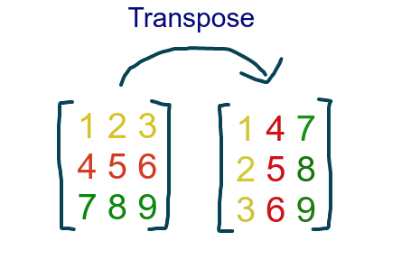

# Formatting a calendar page

This case study is taken from [Component programming with ranges](https://wiki.dlang.org/Component_programming_with_ranges) by By H. S. Teoh written for [D](https://dlang.org/).

We shall use as example the classic task of laying out a yearly calendar on the console, such that given a particular year, the program will print out a number of lines that displays the 12 months in a nice grid layout, with numbers indicating each day within the month. Something like this: 

```
       January              February                March        
                 1  2      1  2  3  4  5  6         1  2  3  4  5
  3  4  5  6  7  8  9   7  8  9 10 11 12 13   6  7  8  9 10 11 12
 10 11 12 13 14 15 16  14 15 16 17 18 19 20  13 14 15 16 17 18 19
 17 18 19 20 21 22 23  21 22 23 24 25 26 27  20 21 22 23 24 25 26
 24 25 26 27 28 29 30  28 29                 27 28 29 30 31
 31

         April                  May                  June  
                 1  2   1  2  3  4  5  6  7            1  2  3  4
  3  4  5  6  7  8  9   8  9 10 11 12 13 14   5  6  7  8  9 10 11
 10 11 12 13 14 15 16  15 16 17 18 19 20 21  12 13 14 15 16 17 18
 17 18 19 20 21 22 23  22 23 24 25 26 27 28  19 20 21 22 23 24 25
 24 25 26 27 28 29 30  29 30 31              26 27 28 29 30

         July                 August               September  
                 1  2      1  2  3  4  5  6               1  2  3
  3  4  5  6  7  8  9   7  8  9 10 11 12 13   4  5  6  7  8  9 10
 10 11 12 13 14 15 16  14 15 16 17 18 19 20  11 12 13 14 15 16 17
 17 18 19 20 21 22 23  21 22 23 24 25 26 27  18 19 20 21 22 23 24
 24 25 26 27 28 29 30  28 29 30 31           25 26 27 28 29 30
 31

        October              November              December  
                    1         1  2  3  4  5               1  2  3
  2  3  4  5  6  7  8   6  7  8  9 10 11 12   4  5  6  7  8  9 10
  9 10 11 12 13 14 15  13 14 15 16 17 18 19  11 12 13 14 15 16 17
 16 17 18 19 20 21 22  20 21 22 23 24 25 26  18 19 20 21 22 23 24
 23 24 25 26 27 28 29  27 28 29 30           25 26 27 28 29 30 31
 30 31
 ```
 
 While intuitively straightforward, this task has many points of complexity.

Although generating all dates in a year is trivial, the order in which they must be processed is far from obvious. Since we're writing to the console, we're limited to outputting one line at a time; we can't draw one cell of the grid and then go back up a few lines, move a few columns over, and draw the next cell in the grid. We have to somehow print the first lines of all cells in the top row, followed by the second lines, then the third lines, etc., and repeat this process for each row in the grid. Of course, we could create an internal screen buffer that we can write to in arbitrary order, and then output this buffer line-by-line at the end, but this approach is not as elegant because it requires a much bigger memory footprint than is really necessary.

In any case, as a result of this mismatch between the structure of the calendar and the structure of the output, the order in which the days in a month must be processed is not the natural, chronological order. We have to assemble the dates for the first weeks in each of the first 3 months, say, if we are putting 3 months per row in the grid, print those out, then assemble the dates for the second weeks in each month, print those out, etc.. Furthermore, within the rows representing each week, some days may be missing, depending on where the boundaries of adjacent months fall; these missing days must be filled out in the following month's first week before the first full week in the month is printed. It is not that simple to figure out where a week starts and ends, and how many rows are needed per month. Then if some months have more full weeks than others, they may occupy less vertical space than other months on the same row in the grid; so we need to insert blank spaces into these shorter months in order for the grid cells to line up vertically in the output.

With this level of complexity, writing our calendar program using the traditional ad hoc way of resolving structure conflicts will certainly result in very complex, hard-to-understand, and bug-prone code. There would not be much hope of getting any reusable pieces out of it.

Nonetheless the end result will look pretty simple, and it will be completley streamable.

## Create the date-range

There are obviously many ways to achieve this, you could write your own Implementation of `IEnumerable<T>` with a hand written `IEnumerator<T>` or you could simply write a function and take advantage of `yield` to create the iterator.

We want to avoid to write such a function and take advantage of the numerous generators availaible in Funcky.

Sequence.Successors creates an infinite sequence of days, starting with January first of the given year. We take all the values in the same year, so this sequence should yield all the days of a year.

```cs
return Sequence.Successors(JanuaryFirst(year), NextDay)
    .TakeWhile(IsSameYear(year));
```

Most of these helper function are straight forward, but `IsSameYear` might be a bit special if you havent worked with curried functions before.

The function `IsSameYear` takes one parameter and returns a function which takes another parameter, this is also called the curried form of a function, there is also the `Functional.Curry` and `Functional.Uncurry` functions which can transform between both forms without the need to write them both. `IsSameYear(2000)` returns a function which always returns `true` if the Date is from the year 2000. That way of using functions might come in handy a lot more often than you think.

```cs
private static DateOnly NextDay(DateOnly day)
    => day.AddDays(1);

private static DateOnly JanuaryFirst(int year)
    => new(year, 1, 1);

private static Func<DateOnly, bool> IsSameYear(int year)
    => day
        => day.Year == year;
```

This makes the the main body of the code semantic very easy to understand. All the helper functions are trivially to understand on it's own too.

## Group this into months

LINQ offers you the GroupBy function which we could use easily in this case.  This way we would have 12 groups, in each group we would have all the days of one month of the given year.

```cs
return Sequence.Successors(JanuaryFirst(year), NextDay)
    .TakeWhile(IsSameYear(year))
    .GroupBy(d => d.Month)
```

There are two things we should consider here though.

1.) GroupBy is like the SQL GROUP BY and can rearrange elements, and therefore is not a lazy Extension function.
2.) GroupBy would also Group all days from a different year into the same 12 montly buckets.

Often that is exactly what you want, but in this case if we think of an endless stream of days this is not what we need at all. The days do not need to be rearranged, all days in the same month are next to each other and if we find a second January, we would like to have a new 13th bucket.

That is why Funcky offers the extension function `AdjacentGroupBy`. It is a fully lazy, forward only `GroupBy`. Exactly what we need here.

```cs
return Sequence.Successors(JanuaryFirst(year), NextDay)
    .TakeWhile(IsSameYear(year))
    .AdjacentGroupBy(d => d.Month);
```

Now we have an `IEnumerable<IEnumerable<DateOnly>>`, where the inner `IEnumerable` is representing a single month.

## Layout a single month

Since we have now all the days of the same month, we want to create a layout for a single month out of these days.

Currently we have a sequence of months. To transform the inner element, from a sequence of days into something else, we need to make a projection which is done with `Select` in C#.

```cs
return Sequence.Successors(JanuaryFirst(year), NextDay)
    .TakeWhile(IsSameYear(year))
    .AdjacentGroupBy(d => d.Month);
    .Select(LayoutMonth)
```

The `LayoutMonth` function therefore gets a sequence of all the day days in a single month, and should produce a Layout for that single Month.


This is actually pretty straight forward. What do we want? We want to format a single month, and how would a single month look like? So the result will be a sequence of strings, each string representing one line of the layout.

```
        April       
                1  2
 3  4  5  6  7  8  9
10 11 12 13 14 15 16
17 18 19 20 21 22 23
24 25 26 27 28 29 30
```

First, we decompose the problem once more: we start with one line where we print the month, then a few lines which represent a week and we also have an empty line at the end, but that is just layout sugar.

We need a few helper functions again: the most important step is grouping the days by week, and then we pass each week to a FormatWeek function.

```cs
private static IEnumerable<string> LayoutMonth(IEnumerable<DateOnly> month)
{
    yield return CenteredMonthName(month);

    foreach (var week in month.AdjacentGroupBy(GetWeekOfYear).Select(FormatWeek))
    {
        yield return week;
    }

    yield return $"{string.Empty,WidthOfAWeek}";
} 
```

This is a fine way to do this, it is very easy to read, but the foreach is really annoying. We already have an `IEnumerable<T>`, we just want to add it between the first and the last line. But with yield you are often limited to very procedural constructs.

Often you can avoid that, for simple cases we have Sequence.Return, Concat and other helpers, in this case though the nicest way is probaly creating an ImmutableList, because the syntax allows to combine ranges and single items elegantly.

```cs
private static IEnumerable<string> LayoutMonth(IEnumerable<DateOnly> month)
    => ImmutableList<string>.Empty
        .Add(CenteredMonthName(month))
        .AddRange(FormatWeeks(month))
        .Add($"{string.Empty,WidthOfAWeek}");
```

Let's dive into our helper functions. First we take a look at the name of the month. The only noteworthy detail is the very functional mindest seen in the solution to the centering problem. It uses a pattern match to fill in the missing spaces: it is not very efficent, but easy to understand. The recursion will be very short because our lines are only 21 characters wide.


```cs
private static string CenteredMonthName(IEnumerable<DateOnly> month)
    => month
        .First()
        .ToString(MonthNameFormat)
        .Center(WidthOfAWeek);


internal static class StringExtensions
{
    public static string Center(this string text, int width)
        => (width - text.Length) switch
        {
            0 => text,
            1 => $" {text}",
            _ => Center($" {text} ", width),
        };
}
```

We have already seen the heart of `FormatWeeks` in the yield solution, but now it is a separate function. `FormatWeeks` again needs 2 very simple helper functions, the first one projects the week of the year, the other one will format a sequence of days.

The sequence of days can be either a complete week, or a partial week from the beginning or the end of the month. But because of the way we construct these sequences, there always is at least one element in it. 

```cs
private static IEnumerable<string> FormatWeeks(IEnumerable<DateOnly> month)
    => month
        .AdjacentGroupBy(GetWeekOfYear)
        .Select(FormatWeek);
```

The GetWeekOfYear function is just calling the API with the correct parameters and always using the current culture and a little fiddling with DateTime (because DateOnly was introduced far too late in C# 10).

```cs
private static int GetWeekOfYear(DateOnly dateTime)
    => CultureInfo
        .CurrentCulture
        .Calendar
        .GetWeekOfYear(dateTime.ToDateTime(default), CultureInfo.CurrentCulture.DateTimeFormat.CalendarWeekRule, CultureInfo.CurrentCulture.DateTimeFormat.FirstDayOfWeek);
```

We are almost done with `FormatMonth`, now we really format the week, each day has a width of 3 characters, we see that in `FormatDay`. This means each line should have the same width of 21 characters. We simply pad the week correctly with the `PadWeek` function.

```cs
private static string FormatWeek(IGrouping<int, DateOnly> week)
    => PadWeek(week.Select(FormatDay).ConcatToString(), week);
  
private static string FormatDay(DateOnly day)
    => $"{day.Day,WidthOfDay}";
```

We can ignore the full weeks, because they are already 21 characters long. How do we distinguish the beginning of the month from the end? The week at the end of the month must start with the first day of the week. So we pad accordingly from left or the right.
  
```cs
private static string PadWeek(string formattedWeek, IGrouping<int, DateOnly> week)
    => StartsOnFirstDayOfWeek(week)
        ? $"{formattedWeek,-WidthOfAWeek}"
        : $"{formattedWeek,WidthOfAWeek}";
```

Now it just boils down to, what is the start of the week? It might be a surprise, that this is actually the most difficult part of this program, because the `DayOfWeek` enum defines Sunday as the first day of the week, which is not true for the largest part of the world, including all of europe. But `CultureInfo` has our back, because it tells us in the `DateTimeFormat`, which day of the week is the first day. However even that needs some calculation with `% DaysInAWeek`.

The function `NthDayOfWeek` gives us a 0 based index beginning with the start of the week. So we can simply check with `is FirstDayOfTheWeek` that we are indeed on the first day of the week. And this works independent of the given culture. Sweet.

```cs
private static bool StartsOnFirstDayOfWeek(IGrouping<int, DateOnly> week)
    => NthDayOfWeek(week.First().DayOfWeek) is FirstDayOfTheWeek;

private static int NthDayOfWeek(DayOfWeek dayOfWeek)
    => (dayOfWeek + DaysInAWeek - CultureInfo.CurrentCulture.DateTimeFormat.FirstDayOfWeek) % DaysInAWeek;
```

Now we have an `IEnumerable<IEnumerable<string>>`, where the inner one is still representing a single month, but each line is already a completeley formatted week.

## Layouting the months together.

At this point we could print a list of months, we just would need to join all the lines together and it would look like this. (shortend to 2 months)

```
        January      
        1  2  3  4  5
  6  7  8  9 10 11 12
 13 14 15 16 17 18 19
 20 21 22 23 24 25 26
 27 28 29 30 31      

       February      
                 1  2
  3  4  5  6  7  8  9
 10 11 12 13 14 15 16
 17 18 19 20 21 22 23
 24 25 26 27 28 29   

```

The next step looks simple: we would need to take line 1, 8, 15 and create the first line of the final output:

```
       January              February                March        
```

And then lines 2, 9 and 16 would be combined to:
```
        1  2  3  4  5                 1  2                    1
```

To do this lazily we use `Chunk`.

`Chunk` is supported with .NET 6, before that Funcky has nearly identical Replacement. (The return type is slightly different)

Chunk is grouping a sequnce into multiple sequnces of the same length. In our case we want to make the sequence of 12 months in to 4 sequences of length 3.

```cs
const MonthsPerRow = 3;

private static string CreateCalendarString(int year)
    => Sequence.Successors(JanuaryFirst(year), NextDay)
        .TakeWhile(IsSameYear(year))
        .AdjacentGroupBy(day => day.Month)
        .Select(LayoutMonth)
        .Chunk(MonthsPerRow);
```

That means we have now an `IEnumerable<IEnumerable<IEnumerable<string>>>` where in the outermost `IEnumerable` we group 3 months together respectivly.

Why does that help us with the layout? To create the first line of our final layout, we need the first lines of each month, and then the second, and so on. So we need to group the months together.

One of these chunks now looks like this:

```
        Januar        |         1  2  3  4  5 |   6  7  8  9 10 11 12 |  13 14 15 16 17 18 19 |  20 21 22 23 24 25 26 |  27 28 29 30 31       |
       Februar        |                  1  2 |   3  4  5  6  7  8  9 |  10 11 12 13 14 15 16 |  17 18 19 20 21 22 23 |  24 25 26 27 28 29    |
         März         |                     1 |   2  3  4  5  6  7  8 |   9 10 11 12 13 14 15 |  16 17 18 19 20 21 22 |  23 24 25 26 27 28 29 |  30 31                |
```

That actually already looks a lot like what we want, but we want the months on the top not on the left.

It also looks like a matrix, and on a matrix the operation to flip the rows and the columns (on a diagonal symmetry) is called transpose.

<p align="center">
  
</p>

Funcky has a lazy `Transpose` extension function for `IEnumerable<IEnumerable<T>>` as long as it is a regular matrix (same length for each subsequence).

```cs
private static string CreateCalendarString(int year)
=> Sequence.Successors(JanuaryFirst(year), NextDay)
  .TakeWhile(IsSameYear(year))
  .AdjacentGroupBy(day => day.Month)
  .Select(LayoutMonth)
  .Chunk(MonthsPerRow)
  .Select(chunk => chunk.Transpose())
```

After this transforamtion our chunk of 3 months looks like this:

```
        Januar        |        Februar        |          März
        1  2  3  4  5 |                  1  2 |                     1
  6  7  8  9 10 11 12 |   3  4  5  6  7  8  9 |   2  3  4  5  6  7  8
 13 14 15 16 17 18 19 |  10 11 12 13 14 15 16 |   9 10 11 12 13 14 15
 20 21 22 23 24 25 26 |  17 18 19 20 21 22 23 |  16 17 18 19 20 21 22
 27 28 29 30 31       |  24 25 26 27 28 29    |  23 24 25 26 27 28 29
                      |                       |  30 31
```

I think it is obvious that at this point, we are done. We just have to join the chunks together to have our final output. 

```cs
private static string CreateCalendarString(int year)
    => Sequence.Successors(JanuaryFirst(year), NextDay)
        .TakeWhile(IsSameYear(year))
        .AdjacentGroupBy(day => day.Month)
        .Select(LayoutMonth)
        .Chunk(MonthsPerRow)
        .Select(EnumerableExtensions.Transpose)
        .Select(JoinLine)
        .SelectMany(Identity)
        .JoinToString(Environment.NewLine);
```

For a working solution with all the details, you should take a look at the [complete code in Program.cs](./calendar-code.md)