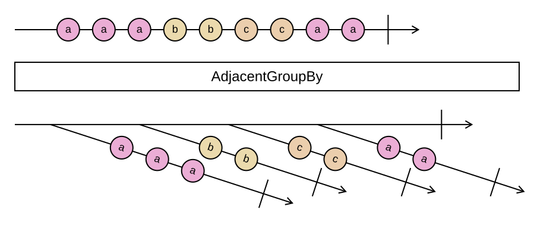

## AdjacentGroupBy

Groups runs of consecutive elements that share a key. Where `GroupBy` collects all elements with the same key
from the whole sequence, `AdjacentGroupBy` starts a new group every time the key changes.

```cs
IEnumerable<IGrouping<TKey, TSource>> AdjacentGroupBy<TSource, TKey>(this IEnumerable<TSource> source, Func<TSource, TKey> keySelector)
IEnumerable<IGrouping<TKey, TSource>> AdjacentGroupBy<TSource, TKey>(this IEnumerable<TSource> source, Func<TSource, TKey> keySelector, IEqualityComparer<TKey> comparer)
```

Like `GroupBy`, there are further overloads with an element selector, a result selector taking the key and the
elements, or both, each with and without a comparer.

<picture>
    <picture>
      <source srcset="adjacent-group-by-dark.svg" media="(prefers-color-scheme: dark)">
      
    </picture>
</picture>

The same key can therefore appear in several groups, as `a` does in the diagram. On a sequence that is sorted by
the key, the result is identical to `GroupBy`, and that is the typical use: the data is already ordered, and
`AdjacentGroupBy` can stream it, yielding each group as soon as the next key is seen, instead of reading
everything into a lookup first. Each group is materialized when it is yielded.

This is the same operation as Haskell's `groupBy` and Python's `itertools.groupby`.

### Example

Collapsing a log into runs of the same severity:

```cs
var entries = Sequence.Return(
    new LogEntry(Level.Info, "started"),
    new LogEntry(Level.Info, "listening"),
    new LogEntry(Level.Error, "timeout"),
    new LogEntry(Level.Info, "recovered"));

entries.AdjacentGroupBy(entry => entry.Level, (level, run) => $"{run.Count()} × {level}");
// ["2 × Info", "1 × Error", "1 × Info"]
```

Splitting a date-ordered sequence into days:

```cs
var byDay = events.AdjacentGroupBy(e => DateOnly.FromDateTime(e.Timestamp));
```
