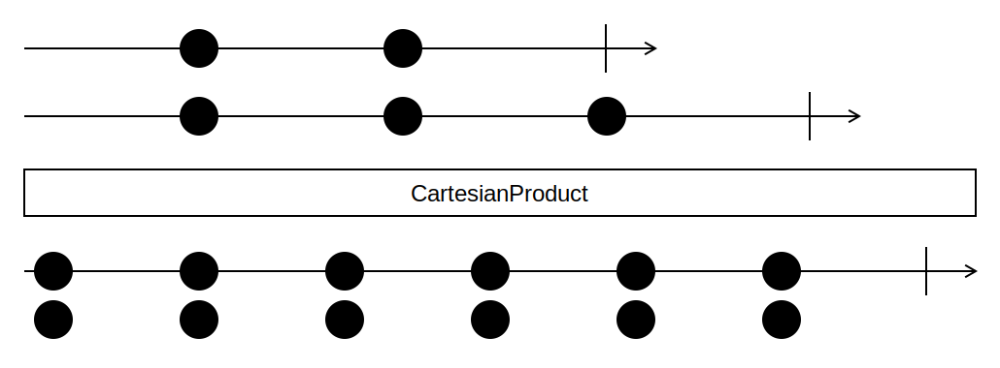

## CartesianProduct

In mathematics, specifically set theory, the Cartesian product of two sets A and B, denoted A×B,
is the set of all ordered pairs (a, b) where a ∈ A and b ∈ B.

In other words: The Cartesian product produces all possible pairs of two given `IEnumerable`s.

<picture>
    <picture>
      <source srcset="cartesian-product-dark.svg" media="(prefers-color-scheme: dark)">
      
    </picture>
</picture>

### Recipe
The Cartesian product can be easily implemented ad-hoc using LINQ's built-in `SelectMany` extension function:

```cs
using System;
using System.Linq;

// Version A: Get each pair as a tuple
var result = sequenceA.SelectMany(_ => sequenceB, ValueTuple.Create);

// Version B: Transform each pair using a selector
var result = sequenceA.SelectMany(_ => sequenceB, (a, b) => ...);

// Version C: Using LINQs declarative query syntax
var result =
    from a in sequenceA
    from b in sequenceB
    select ...;
```


### Examples

Two sequences as input:

```
smiles = [😀, 😐, 🙄]
fruits = [🍉, 🍌, 🍇, 🍓]
```

The Cartesian products of smiles and fruits:

```
smiles × fruits => [[😀, 🍉], [😀, 🍌], [😀, 🍇], [😀, 🍓],
                    [😐, 🍉], [😐, 🍌], [😐, 🍇], [😐, 🍓],
				    [🙄, 🍉], [🙄, 🍌], [🙄, 🍇], [🙄, 🍓]]
```

In this C# example you see how all playing cards are in fact a Cartesian products of a suit and a value.

This example uses the overload with a selector, because we just want a sequence of strings.

```cs
using System;
using System.Linq;
using Funcky;

var suits = Sequence.Return("♠", "♣", "♥", "♦");
var values = Sequence.Return("2", "3", "4", "5", "6", "7", "8", "9", "T", "J", "Q", "K", "A");

var deck = suits.SelectMany(_ => values, (suit, value) => $"{value}{suit}");
```
