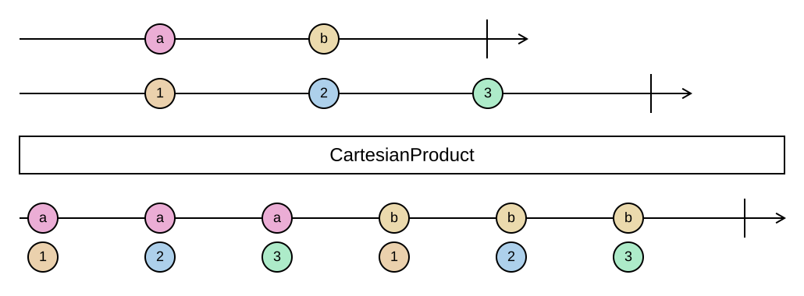

## CartesianProduct

The Cartesian product of two sequences is the sequence of all pairs with the first element from the first
sequence and the second from the second. Funcky does not ship a method for it, because LINQ already has one
under a different name, and this section exists so that you find it.

<picture>
    <picture>
      <source srcset="cartesian-product-dark.svg" media="(prefers-color-scheme: dark)">
      
    </picture>
</picture>

### Recipe

`SelectMany` with a selector that ignores its argument is the Cartesian product:

```cs
// As tuples
var pairs = first.SelectMany(_ => second, ValueTuple.Create);

// With a selector
var combined = first.SelectMany(_ => second, (a, b) => ...);

// In query syntax, which reads most naturally
var combined =
    from a in first
    from b in second
    select ...;
```

The second sequence is enumerated once per element of the first, so if it is expensive to produce, materialize
it before.

### Example

Every playing card is a suit combined with a rank:

```cs
var suits = Sequence.Return("♠", "♣", "♥", "♦");
var ranks = Sequence.Return("2", "3", "4", "5", "6", "7", "8", "9", "T", "J", "Q", "K", "A");

var deck =
    from suit in suits
    from rank in ranks
    select $"{rank}{suit}";
// ["2♠", "3♠", …, "A♦"], 52 cards
```
