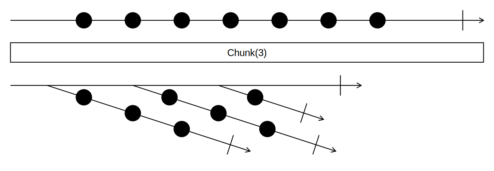

## Chunk

With the `.Chunk(int)` extension method, you can turn an `IEnumerable<T>` into a `IEnumerable<IEnumerable<T>>`, with the inner Enumerables being of the given size.
Empty and negative chunk sizes are not allowed and will throw a `ArgumentOutOfRangeException`.

<picture>
    <picture>
      <source srcset="chunk-dark.svg" media="(prefers-color-scheme: dark)">
      
    </picture>
</picture>

### Examples

```csharp
var numbers = new List<int> { 1, 2, 3, 4, 5, 6, 7, 8, 9 };
var chunked = numbers.Chunk(3);
// Result: IEnumerable with Chunks of size 3:
// 1st Chunk: 1, 2, 3
// 2nd Chunk: 4, 5, 6
// 3rd Chunk: 7, 8, 9
```

When the last chunk isn't complete, we get a smaller, incomplete last chunk:
```csharp
var numbers = new List<int> { 1, 2, 3, 4, 5, 6, 7 };
var chunked = numbers.Chunk(4);
// Result: IEnumerable with Chunks of size 4:
// 1st Chunk: 1, 2, 3, 4
// 2nd Chunk: 5, 6, 7
```

If required, you can also pass a result selector, that turns the inner IEnumerables into a different type:
```csharp
var magicSquare = new List<int> { 4, 9, 2, 3, 5, 7, 8, 1, 6 };
var result = magicSquare.Chunk(3, Enumerable.Average); // equivalent to magicSquare.Chunk(3, number => Enumerable.Average(number));
// Result: IEnumerable<int> with 5, 5, 5 as items
```
