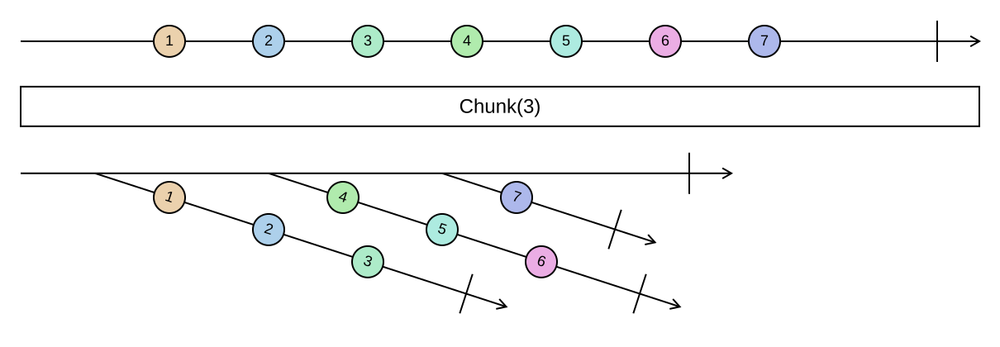

## Chunk

Cuts a sequence into consecutive pieces of a fixed size. The last piece is smaller if the length is not a
multiple of the size.

```cs
IEnumerable<IReadOnlyList<TSource>> Chunk<TSource>(this IEnumerable<TSource> source, int size)
IEnumerable<TResult> Chunk<TSource, TResult>(this IEnumerable<TSource> source, int size, Func<IReadOnlyList<TSource>, TResult> resultSelector)
```

<picture>
    <picture>
      <source srcset="chunk-dark.svg" media="(prefers-color-scheme: dark)">
      
    </picture>
</picture>

A size of zero or less throws an `ArgumentOutOfRangeException` immediately, not on enumeration. The chunks are
produced lazily, but each chunk is materialized when it is yielded, so you can hold on to a chunk after moving
to the next one.

.NET 6 added `Enumerable.Chunk` to the BCL, returning arrays. On those targets Funcky's own `Chunk(size)` steps
aside and the BCL method is picked; the overload with a result selector remains Funcky's, and is the shorter
way to write `Chunk(size).Select(selector)`.

### Example

```cs
var numbers = Sequence.Return(1, 2, 3, 4, 5, 6, 7);

numbers.Chunk(3);
// [[1, 2, 3], [4, 5, 6], [7]]

var magicSquare = Sequence.Return(4, 9, 2, 3, 5, 7, 8, 1, 6);
magicSquare.Chunk(3, row => row.Sum());
// [15, 15, 15]
```
