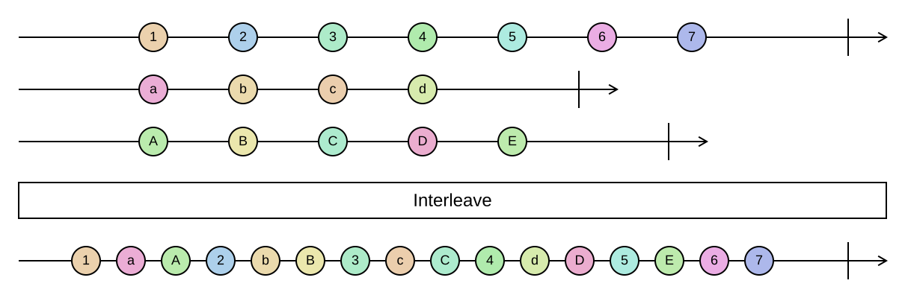

## Interleave

Takes one element from each sequence in turn, round-robin, until all sequences are exhausted.

```cs
IEnumerable<TSource> Interleave<TSource>(this IEnumerable<TSource> source, params IEnumerable<TSource>[] otherSources)
IEnumerable<TSource> Interleave<TSource>(this IEnumerable<IEnumerable<TSource>> source)
```

<picture>
    <picture>
      <source srcset="interleave-dark.svg" media="(prefers-color-scheme: dark)">
      
    </picture>
</picture>

Sequences of different lengths are fine: a sequence that runs out simply drops out of the rotation and the
remaining ones continue. The result therefore contains every element of every input. `Interleave` is lazy and
advances each input only when it is that input's turn.

For two sequences of the same length, `Interleave` is `Zip` followed by flattening the pairs.

### Example

```cs
var numbers = Sequence.Return(1, 2, 3, 4);
var letters = Sequence.Return("a", "b");

numbers.Select(n => n.ToString()).Interleave(letters);
// ["1", "a", "2", "b", "3", "4"]
```

Alternating rows from several sources in a fair way, for example to mix results of different providers:

```cs
var mixed = Sequence.Return(newsFeed, blogFeed, podcastFeed).Interleave().Take(30);
```
