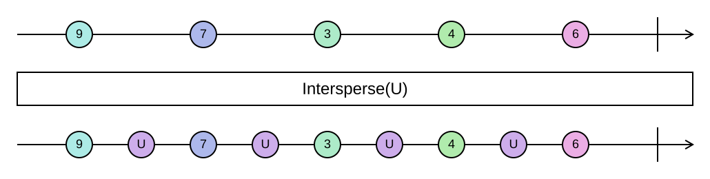

## Intersperse

Inserts a separator element between every two elements of a sequence.

```cs
IEnumerable<TSource> Intersperse<TSource>(this IEnumerable<TSource> source, TSource element)
```

<picture>
    <picture>
      <source srcset="intersperse-dark.svg" media="(prefers-color-scheme: dark)">
      
    </picture>
</picture>

The separator goes only *between* elements: an empty sequence stays empty, and a single element is returned
without a separator. A sequence of *n* elements becomes one of *2n - 1*. The operation is lazy.

This is the sequence counterpart of `string.Join`: `JoinToString(", ")` is `Intersperse(", ")` followed by
concatenation. Use `Intersperse` when the result should stay a sequence, for example to put spacer items into a
list of UI elements.

### Example

```cs
Sequence.Return(9, 7, 3).Intersperse(0);
// [9, 0, 7, 0, 3]

Sequence.Return("a").Intersperse("-");
// ["a"]

var layout = widgets.Intersperse(new Spacer());
```
