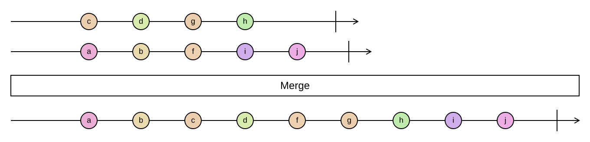

## Merge

Merges two or more sorted sequences into one sorted sequence, like the merge step of a merge sort.

```cs
IEnumerable<TSource> Merge<TSource>(this IEnumerable<TSource> source1, IEnumerable<TSource> source2, Option<IComparer<TSource>> comparer = default)
IEnumerable<TSource> Merge<TSource>(this IEnumerable<TSource> source1, IEnumerable<TSource> source2, IEnumerable<TSource> source3, Option<IComparer<TSource>> comparer = default)
IEnumerable<TSource> Merge<TSource>(this IEnumerable<TSource> source1, IEnumerable<TSource> source2, IEnumerable<TSource> source3, IEnumerable<TSource> source4, Option<IComparer<TSource>> comparer = default)
IEnumerable<TSource> Merge<TSource>(this IEnumerable<IEnumerable<TSource>> sources, Option<IComparer<TSource>> comparer = default)
```

<picture>
    <picture>
      <source srcset="merge-dark.svg" media="(prefers-color-scheme: dark)">
      
    </picture>
</picture>

The inputs must already be sorted by the same comparer, which defaults to `Comparer<T>.Default`. `Merge` does
not check this; on unsorted input it still produces all elements, but not in order. At each step it looks at
the current head of every input and yields the smallest. When two heads compare equal, the one from the earlier
input wins, so the merge is stable.

`Merge` is lazy and streams: it holds one element per input, never materializes anything, and works on infinite
inputs. This is what distinguishes it from `Concat(...).OrderBy(...)`, which has to read everything first.

### Example

```cs
var odds = Sequence.Return(1, 3, 5, 9);
var evens = Sequence.Return(2, 4, 6);

odds.Merge(evens);
// [1, 2, 3, 4, 5, 6, 9]

var byNewest = Comparer<LogEntry>.Create((a, b) => b.Timestamp.CompareTo(a.Timestamp));
var combinedLog = Sequence.Return(webLog, dbLog, workerLog).Merge(byNewest);
```
