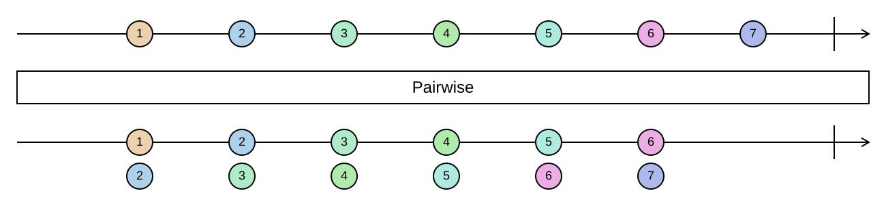

## Pairwise

Pairs each element with the one that follows it.

```cs
IEnumerable<(TSource Front, TSource Back)> Pairwise<TSource>(this IEnumerable<TSource> source)
IEnumerable<TResult> Pairwise<TSource, TResult>(this IEnumerable<TSource> source, Func<TSource, TSource, TResult> resultSelector)
```

<picture>
    <picture>
      <source srcset="pairwise-dark.svg" media="(prefers-color-scheme: dark)">
      
    </picture>
</picture>

A sequence of *n* elements produces *n - 1* pairs; an empty sequence or a single element produces nothing.
Every element except the first and the last appears twice, once as `Back` and once as `Front`. The operation
is lazy and holds on to only one element at a time.

Compare [`WithPrevious`](./element-context.md#withprevious), which keeps every element and makes the
predecessor an `Option`, so the first element is not dropped.

### Example

Differences between consecutive measurements:

```cs
var temperatures = Sequence.Return(20, 22, 21, 25);

temperatures.Pairwise();
// [(20, 22), (22, 21), (21, 25)]

temperatures.Pairwise((before, after) => after - before);
// [2, -1, 4]
```
