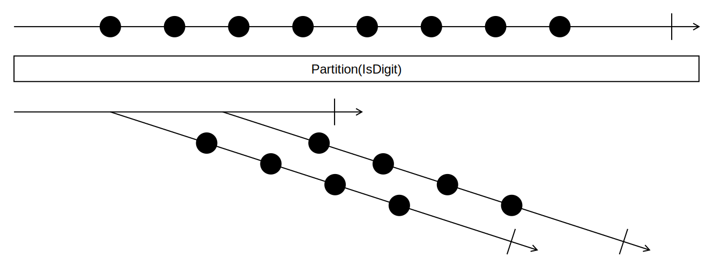

## Partition

<picture>
    <picture>
      <source srcset="partition-dark.svg" media="(prefers-color-scheme: dark)">
      
    </picture>
</picture>

### Example

```
plantBasedFood = [🍉, 🍩 , 🎂, 🍌, 🍫, 🍓, 🍒, 🥕, 🌽, 🥧 ]

plantBasedFood.Partition(IsProcessedFood?)
  => [[🍩 , 🎂, 🍫, 🥧],
      [🍉, 🍌, 🍓, 🍒, 🥕, 🌽]]
```
