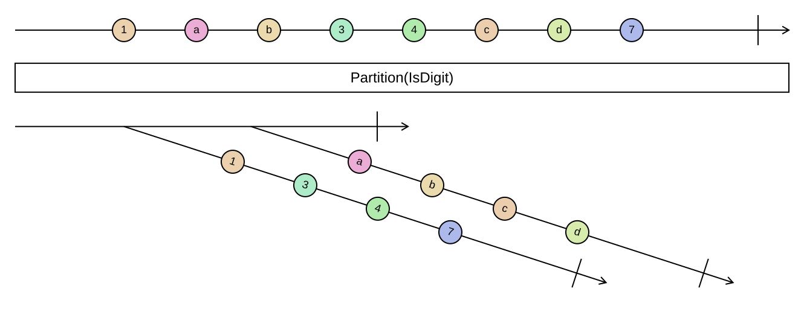

## Partition

Splits a sequence into two lists in a single pass: the elements for which a predicate holds and those for which
it does not. Further overloads split a sequence of `Either` or `Result` values by their case.

```cs
Partitions<TSource> Partition<TSource>(this IEnumerable<TSource> source, Func<TSource, bool> predicate)
TResult Partition<TSource, TResult>(this IEnumerable<TSource> source, Func<TSource, bool> predicate, Func<IReadOnlyList<TSource>, IReadOnlyList<TSource>, TResult> resultSelector)
```

<picture>
    <picture>
      <source srcset="partition-dark.svg" media="(prefers-color-scheme: dark)">
      
    </picture>
</picture>

`Partition` is eager: it enumerates the whole input once and returns two materialized lists, in the original
order. The alternative, `Where(p)` and `Where(x => !p(x))`, enumerates the input twice and evaluates the
predicate twice per element. The result struct has `True` and `False` properties and deconstructs in that order.
The result selector overload receives the two lists directly, which saves the intermediate struct when you
only want a projection of them.

### Example

```cs
var (evens, odds) = Enumerable.Range(1, 8).Partition(n => n % 2 == 0);
// evens: [2, 4, 6, 8]
// odds:  [1, 3, 5, 7]

var summary = orders.Partition(
    order => order.IsPaid,
    (paid, unpaid) => $"{paid.Count} paid, {unpaid.Count} outstanding");
```

### Partitioning by `Either` and `Result`

A sequence of `Either<L, R>` splits into the left and the right values, and a sequence of `Result<T>` into the
exceptions and the ok values. For `Either` there are also overloads that take the selector producing the eithers,
so the `Select` can be folded into the `Partition`.

```cs
EitherPartitions<TLeft, TRight> Partition<TLeft, TRight>(this IEnumerable<Either<TLeft, TRight>> source)
EitherPartitions<TLeft, TRight> Partition<TSource, TLeft, TRight>(this IEnumerable<TSource> source, Func<TSource, Either<TLeft, TRight>> selector)
ResultPartitions<TValidResult> Partition<TValidResult>(this IEnumerable<Result<TValidResult>> source)
```

Each of these has a counterpart with a result selector receiving the two lists.

<picture>
    <picture>
      <source srcset="partition-either-dark.svg" media="(prefers-color-scheme: dark)">
      
    </picture>
</picture>

`EitherPartitions` deconstructs into `(left, right)`, `ResultPartitions` into `(error, ok)`. This is the
"process everything and report all failures" counterpart to `Sequence` and `Traverse`, which stop at the first
failure; see the [Result chapter](../result.md#working-with-many-results).

```cs
var (errors, orders) = requests
    .Select(request => PlaceOrder(request))   // each returns Result<Order>
    .Partition();

var (invalid, valid) = lines.Partition(line => ValidateLine(line));   // returns Either<ValidationError, Record>
```
