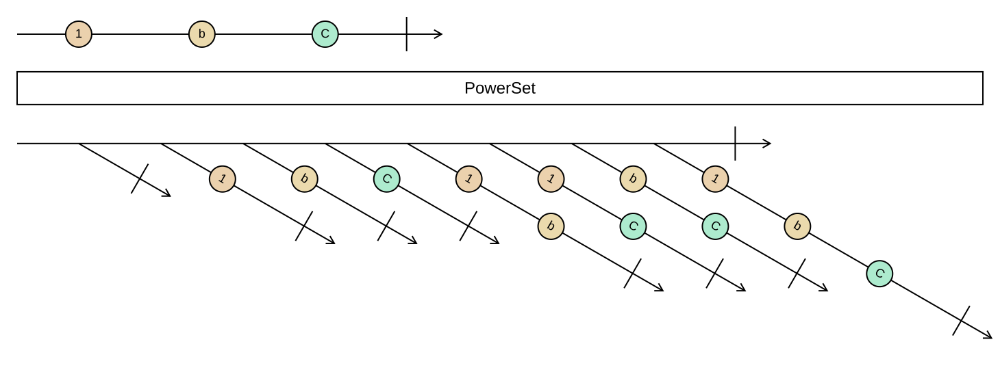

## PowerSet

Produces every subset of the input, including the empty set and the input itself.

```cs
IEnumerable<IEnumerable<TSource>> PowerSet<TSource>(this IEnumerable<TSource> source)
```

<picture>
    <picture>
      <source srcset="power-set-dark.svg" media="(prefers-color-scheme: dark)">
      
    </picture>
</picture>

A sequence of *n* elements has 2ⁿ subsets, so this is only practical for small inputs. The subsets are produced
in a fixed order: first all subsets without the last input element, then the same subsets with it added. The
whole input is read before the first subset is yielded. Elements are treated by position, not by value, so
duplicates in the input produce duplicate subsets.

### Example

```cs
Sequence.Return("a", "b", "c").PowerSet();
// [[], [a], [b], [a, b], [c], [a, c], [b, c], [a, b, c]]
```

All ways to choose toppings whose total price fits a budget:

```cs
var affordable = toppings
    .PowerSet()
    .Where(choice => choice.Sum(t => t.Price) <= budget);
```
