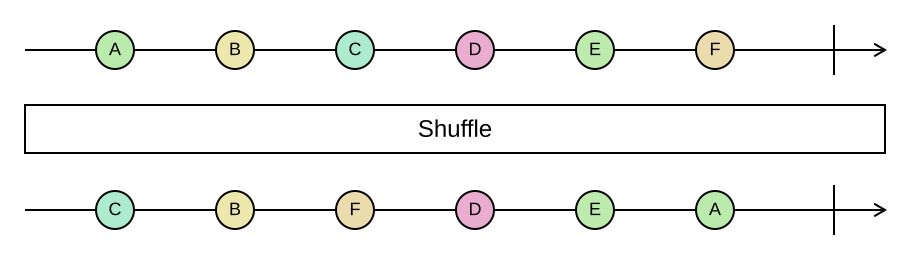

## Shuffle

Returns the elements in random order.

```cs
IReadOnlyList<TSource> Shuffle<TSource>(this IEnumerable<TSource> source)
IReadOnlyList<TSource> Shuffle<TSource>(this IEnumerable<TSource> source, Random random)
```

<picture>
    <picture>
      <source srcset="shuffle-dark.svg" media="(prefers-color-scheme: dark)">
      
    </picture>
</picture>

`Shuffle` is eager: it materializes the input and shuffles it in linear time with a Fisher–Yates shuffle, which
gives every permutation the same probability. `OrderBy(_ => random.Next())` is the common alternative; it is
slower and, with a poorly chosen key, biased. Pass a `Random` to get reproducible results in tests or to use a
seeded generator.

.NET 10 added `Shuffle` to LINQ as a lazy operator. On that target the parameterless `Shuffle()` resolves to the
BCL method, while the overload taking a `Random` stays Funcky's.

### Example

```cs
var deck = cards.Shuffle();

var fixedOrder = cards.Shuffle(new Random(42));   // deterministic
```
