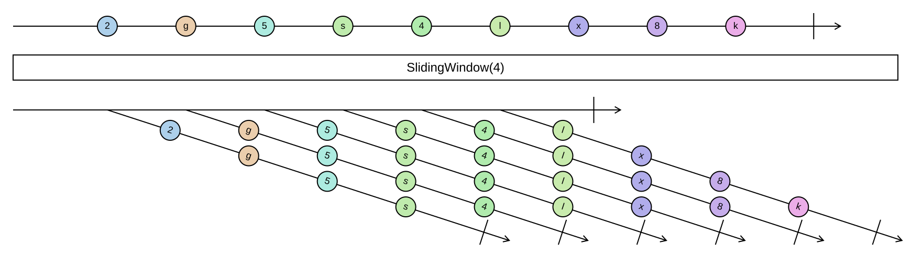

## SlidingWindow

Produces every window of a fixed width, moving one element at a time. Consecutive windows overlap in all but
one element.

```cs
IEnumerable<IReadOnlyList<TSource>> SlidingWindow<TSource>(this IEnumerable<TSource> source, int width)
```

<picture>
    <picture>
      <source srcset="sliding-window-dark.svg" media="(prefers-color-scheme: dark)">
      
    </picture>
</picture>

Only full windows are produced. A sequence shorter than the width yields nothing, and a sequence of exactly
the width yields one window. A width of zero or less throws an `ArgumentOutOfRangeException`. The windows are
produced lazily and each one is an immutable snapshot.

`SlidingWindow(2)` is `Pairwise` with lists instead of tuples; use `Pairwise` when the width is two.

### Example

A moving average over the last three readings:

```cs
var readings = Sequence.Return(2, 4, 6, 8, 10);

readings.SlidingWindow(3);
// [[2, 4, 6], [4, 6, 8], [6, 8, 10]]

readings.SlidingWindow(3).Select(window => window.Average());
// [4, 6, 8]
```
