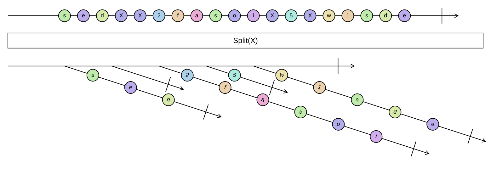

## Split

Cuts a sequence at every occurrence of a separator element, like `string.Split` on a string.

```cs
IEnumerable<IReadOnlyList<TSource>> Split<TSource>(this IEnumerable<TSource> source, TSource separator)
IEnumerable<IReadOnlyList<TSource>> Split<TSource>(this IEnumerable<TSource> source, TSource separator, IEqualityComparer<TSource> comparer)
IEnumerable<TResult> Split<TSource, TResult>(this IEnumerable<TSource> source, TSource separator, IEqualityComparer<TSource> comparer, Func<IReadOnlyList<TSource>, TResult> resultSelector)
```

<picture>
    <picture>
      <source srcset="split-dark.svg" media="(prefers-color-scheme: dark)">
      
    </picture>
</picture>

The separators themselves are not part of the result. Two adjacent separators produce an empty part between
them, and a separator at the very start produces an empty first part. A separator at the very end does not
produce a trailing empty part, and an empty source produces no parts at all. The parts are produced lazily
and each part is materialized when it is yielded.

### Example

Splitting a token stream into statements:

```cs
var tokens = Sequence.Return("let", "x", ";", "print", "x", ";", ";", "exit");

tokens.Split(";");
// [["let", "x"], ["print", "x"], [], ["exit"]]

tokens.Split(";", StringComparer.Ordinal, statement => string.Join(' ', statement));
// ["let x", "print x", "", "exit"]
```
