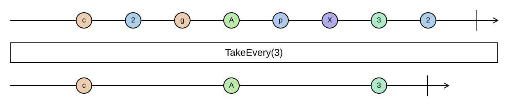

## TakeEvery

Keeps the first element and then every *n*-th element after it.

```cs
IEnumerable<TSource> TakeEvery<TSource>(this IEnumerable<TSource> source, int interval)
```

<picture>
    <picture>
      <source srcset="take-every-dark.svg" media="(prefers-color-scheme: dark)">
      
    </picture>
</picture>

The elements at indices 0, *n*, 2*n*, … are kept. To start at a different offset, `Skip` first. An interval of
zero or less throws an `ArgumentOutOfRangeException` immediately; `TakeEvery(1)` is the identity.

### Example

```cs
Enumerable.Range(1, 10).TakeEvery(3);
// [1, 4, 7, 10]

Enumerable.Range(1, 10).Skip(1).TakeEvery(3);
// [2, 5, 8]
```
