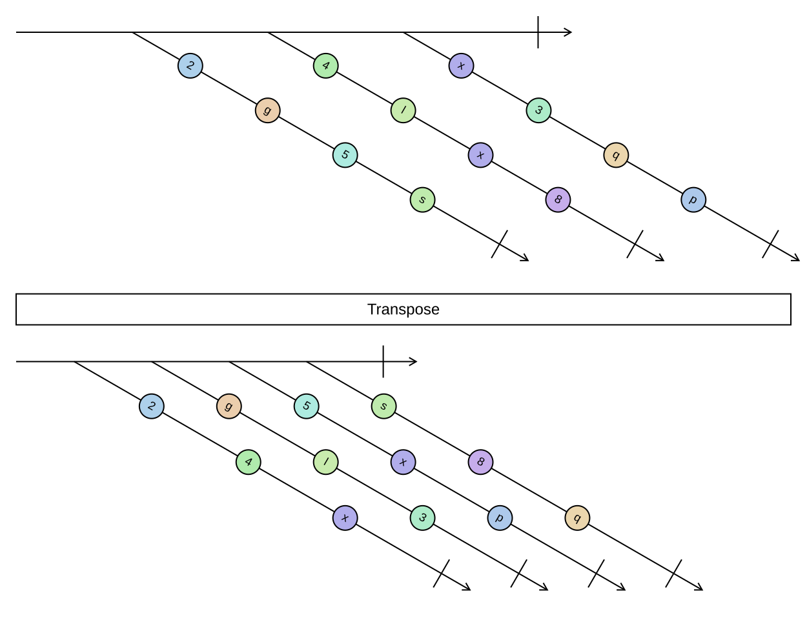

## Transpose

Swaps rows and columns of a sequence of sequences, so that the first result row holds the first element of
every input row, and so on.

```cs
IEnumerable<IReadOnlyList<TSource>> Transpose<TSource>(this IEnumerable<IEnumerable<TSource>> source)
```

<picture>
    <picture>
      <source srcset="transpose-dark.svg" media="(prefers-color-scheme: dark)">
      
    </picture>
</picture>

All input rows must have the same length; the behaviour for jagged input is unspecified. The outer sequence is
enumerated more than once, so pass a materialized collection rather than a one-shot iterator. An empty outer
sequence transposes to an empty sequence.

### Example

```cs
var matrix = Sequence.Return(
    Sequence.Return(1, 2, 3),
    Sequence.Return(4, 5, 6));

matrix.Transpose();
// [[1, 4], [2, 5], [3, 6]]
```

Turning a list of records into columns, for example to compute a per-column statistic:

```cs
var columns = rows.Select(row => row.Values).Transpose();
var columnMaxima = columns.Select(column => column.MaxOrNone());
```
