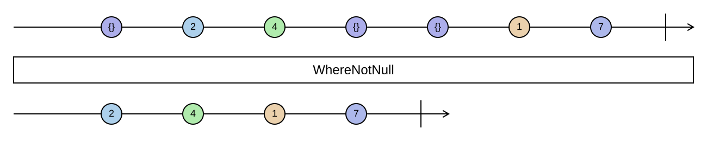

## WhereNotNull

Drops the `null` elements of a sequence, and narrows the element type from `T?` to `T`.

```cs
IEnumerable<TSource> WhereNotNull<TSource>(this IEnumerable<TSource?> source) where TSource : class
IEnumerable<TSource> WhereNotNull<TSource>(this IEnumerable<TSource?> source) where TSource : struct
```

<picture>
    <picture>
      <source srcset="where-not-null-dark.svg" media="(prefers-color-scheme: dark)">
      
    </picture>
</picture>

`Where(x => x != null)` removes the nulls but leaves the static type as `IEnumerable<T?>`, so every later use
still needs a null check or a `!`. `WhereNotNull` changes the type, which is the whole point: the compiler knows
the nulls are gone. It works for nullable reference types and for `Nullable<T>`, unwrapping the latter.

It is the bridge from APIs that return `null` into Funcky's `notnull`-constrained world, and the first step
before `FirstOrNone` and friends on a sequence with nullable elements.

### Example

```cs
IEnumerable<string?> lines = Sequence.Return("a", null, "b");
IEnumerable<string> nonNull = lines.WhereNotNull();
// ["a", "b"]

IEnumerable<int?> readings = Sequence.Return<int?>(1, null, 3);
IEnumerable<int> values = readings.WhereNotNull();
// [1, 3]

var envValues = names
    .Select(Environment.GetEnvironmentVariable)
    .WhereNotNull();
```
