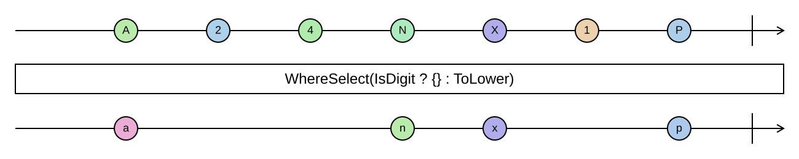

## WhereSelect

`Select` with a selector that may decline: the selector returns an `Option<T>`, and the `None`s are dropped.

```cs
IEnumerable<TResult> WhereSelect<TSource, TResult>(this IEnumerable<TSource> source, Func<TSource, Option<TResult>> selector)
IEnumerable<TResult> WhereSelect<TSource, TResult>(this IEnumerable<TSource> source, Func<TSource, int, Option<TResult>> selector)
IEnumerable<TSource> WhereSelect<TSource>(this IEnumerable<Option<TSource>> source)
```

<picture>
    <picture>
      <source srcset="where-select-dark.svg" media="(prefers-color-scheme: dark)">
      
    </picture>
</picture>

This is the operation that makes the `…OrNone` methods compose with sequences. Where you would otherwise
write a `Where` to filter out the inputs that will fail, followed by a `Select` that transforms the rest, often
duplicating the check, `WhereSelect` does both in one step with one function. In the "option is a list with at
most one element" picture from the [Option chapter](../option.md), it is simply `SelectMany`.

The overload without a selector flattens a sequence of options, keeping the `Some` values. The indexed overload
hands the selector the element's position as well, like the indexed `Select`.

`WhereSelect` is lazy. The selector is called once per element.

### Example

Parsing what can be parsed:

```cs
var input = Sequence.Return("12", "abc", "7", "", "40");

input.WhereSelect(ParseExtensions.ParseInt32OrNone);
// [12, 7, 40]
```

Looking up what exists:

```cs
IEnumerable<User> FindUsers(IEnumerable<int> ids)
    => ids.WhereSelect(usersById.GetValueOrNone);
```

Keeping only the present values of a sequence of options:

```cs
var found = Sequence.Return(Option.Some(1), Option<int>.None, Option.Some(3)).WhereSelect();
// [1, 3]
```
