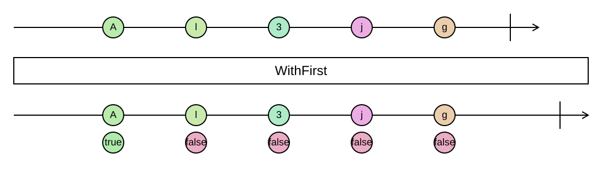

## WithFirst

Pairs each element with a flag telling whether it is the first one.

```cs
IEnumerable<ValueWithFirst<TSource>> WithFirst<TSource>(this IEnumerable<TSource> source)
```

<picture>
    <picture>
      <source srcset="with-first-dark.svg" media="(prefers-color-scheme: dark)">
      
    </picture>
</picture>

`ValueWithFirst<T>` has `Value` and `IsFirst` and deconstructs in that order. Exactly one element has
`IsFirst == true`, unless the sequence is empty. The operation is lazy and streams; it needs no lookahead.

### Example

Rendering a list where the first entry gets special treatment:

```cs
var lines = steps.WithFirst().Select(step => step.IsFirst
    ? $"Start with {step.Value}"
    : $"then {step.Value}");
```

This is also how `Intersperse` is implemented: emit a separator before every element that is not the first.
