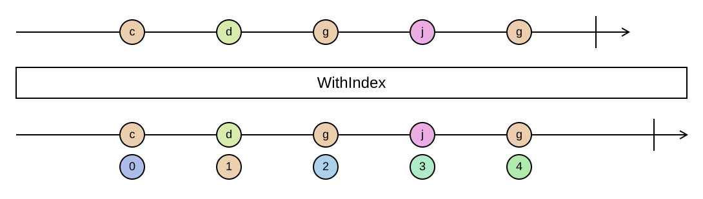

## WithIndex

Pairs each element with its zero-based position.

```cs
IEnumerable<ValueWithIndex<TSource>> WithIndex<TSource>(this IEnumerable<TSource> source)
```

<picture>
    <picture>
      <source srcset="with-index-dark.svg" media="(prefers-color-scheme: dark)">
      
    </picture>
</picture>

`ValueWithIndex<T>` has a `Value` and an `Index` property and deconstructs in that order. Like all the `With…`
operations it is lazy, and when the source is an `IList<T>` the result is a list as well, so it keeps `Count`
and indexing without enumerating.

.NET 9 added `Index()` to LINQ, which returns `(int Index, T Item)` tuples. `WithIndex` is available on every
target framework and puts the value first, matching the other `With…` types.

### Example

```cs
var names = Sequence.Return("Ada", "Grace", "Linus");

names.WithIndex().Select(n => $"{n.Index + 1}. {n.Value}");
// ["1. Ada", "2. Grace", "3. Linus"]

foreach (var (name, index) in names.WithIndex())
{
    Console.WriteLine($"{index}: {name}");
}
```
