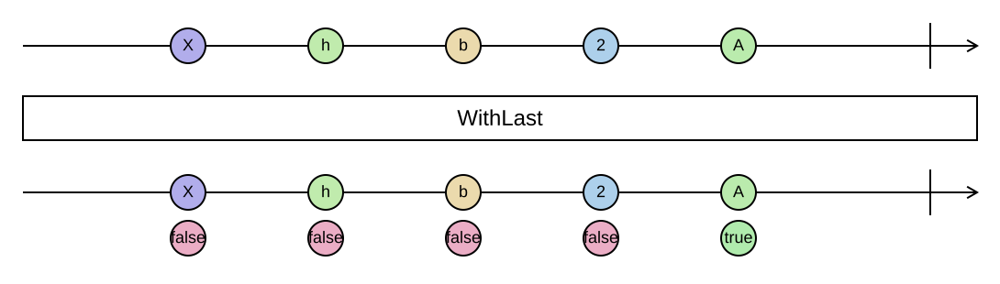

## WithLast

Pairs each element with a flag telling whether it is the last one.

```cs
IEnumerable<ValueWithLast<TSource>> WithLast<TSource>(this IEnumerable<TSource> source)
```

<picture>
    <picture>
      <source srcset="with-last-dark.svg" media="(prefers-color-scheme: dark)">
      
    </picture>
</picture>

`ValueWithLast<T>` has `Value` and `IsLast` and deconstructs in that order. To know that an element is the last
one, `WithLast` has to try reading the next one first. On a plain `IEnumerable<T>` it therefore runs one element
behind the source: each element is yielded only when its successor has been read, or the end has been reached.
On an `IList<T>` the count is known and there is no delay.

The delay matters for sources that block, such as a stream of events: the last event is not visible until the
source completes.

### Example

Joining with a terminator, in the way `string.Join` cannot:

```cs
var sql = columns
    .WithLast()
    .Select(column => column.IsLast ? $"{column.Value};" : $"{column.Value},")
    .ConcatToString();
```
