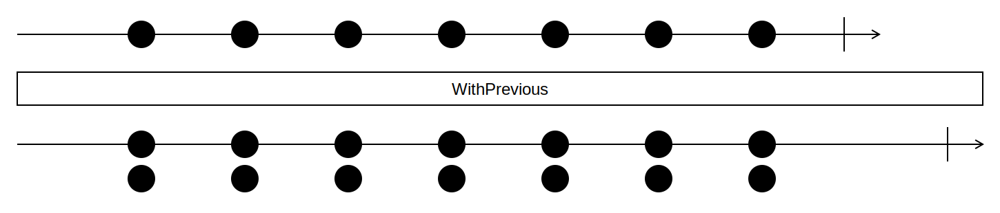

## WithPrevious

<picture>
    <picture>
      <source srcset="with-previous-dark.svg" media="(prefers-color-scheme: dark)">
      
    </picture>
</picture>

### Example

```
animals = [ 🦄, 🐺, 🐷, 🦁, 🐵, 🐶 ]

animals.WithPrevious() =>
    [[∅, 🦄],
	 [🦄, 🐺],
	 [🐺, 🐷],
	 [🐷, 🦁],
	 [🦁, 🐵],
	 [🐵, 🐶]]
```
