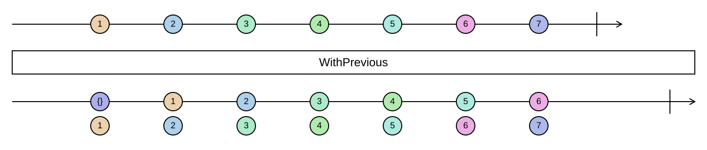

## WithPrevious

Pairs each element with the element before it, as an `Option`.

```cs
IEnumerable<ValueWithPrevious<TSource>> WithPrevious<TSource>(this IEnumerable<TSource> source)
```

<picture>
    <picture>
      <source srcset="with-previous-dark.svg" media="(prefers-color-scheme: dark)">
      
    </picture>
</picture>

`ValueWithPrevious<T>` has `Value` and `Previous`, where `Previous` is `None` for the first element and `Some`
of the predecessor for every other one. The result has as many elements as the input. Compare
[`Pairwise`](./grouping-and-windowing.md#pairwise), which produces tuples of neighbours and therefore one
element fewer, dropping the first.

The element type is constrained to `notnull`, because `Previous` is an `Option<T>`.

### Example

Marking where a sorted sequence changes value:

```cs
var readings = Sequence.Return(1, 1, 2, 2, 2, 3);

readings
    .WithPrevious()
    .Where(r => r.Previous.Select(p => p != r.Value).GetOrElse(true))
    .Select(r => r.Value);
// [1, 2, 3]
```
