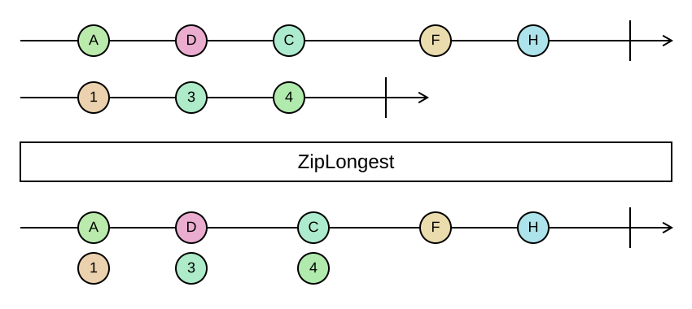

## ZipLongest

Pairs up two sequences element by element, like `Zip`, but keeps going until the *longer* one is exhausted.

```cs
IEnumerable<EitherOrBoth<TLeft, TRight>> ZipLongest<TLeft, TRight>(this IEnumerable<TLeft> left, IEnumerable<TRight> right)
IEnumerable<TResult> ZipLongest<TLeft, TRight, TResult>(this IEnumerable<TLeft> left, IEnumerable<TRight> right, Func<EitherOrBoth<TLeft, TRight>, TResult> resultSelector)
```

<picture>
    <picture>
      <source srcset="zip-longest-dark.svg" media="(prefers-color-scheme: dark)">
      
    </picture>
</picture>

`Zip` stops at the end of the shorter sequence and silently drops the rest of the longer one. `ZipLongest`
instead produces an `EitherOrBoth<L, R>` for every position: `Both(left, right)` while both sequences have
elements, then `Left(left)` or `Right(right)` for the remaining elements of whichever is longer. There is no
default value to invent, so nothing is invented.

`EitherOrBoth` is handled with `Match` or `Switch`, which take three functions. The result selector overload is
the shorter way to write `ZipLongest(right).Select(selector)`.

### Example

```cs
var expected = Sequence.Return("a", "b", "c");
var actual = Sequence.Return("a", "x");

expected.ZipLongest(actual, pair => pair.Match(
    both: (e, a) => e == a ? $"{e} ok" : $"{e} != {a}",
    left: e => $"{e} missing",
    right: a => $"{a} unexpected"));
// ["a ok", "b != x", "c missing"]
```
